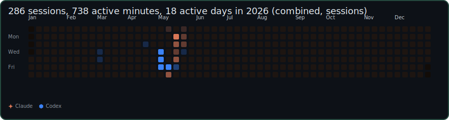
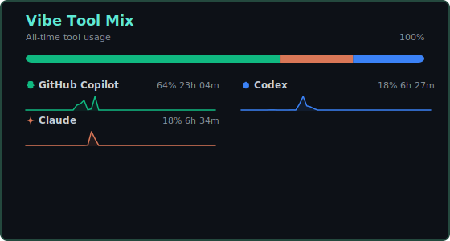
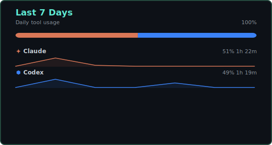
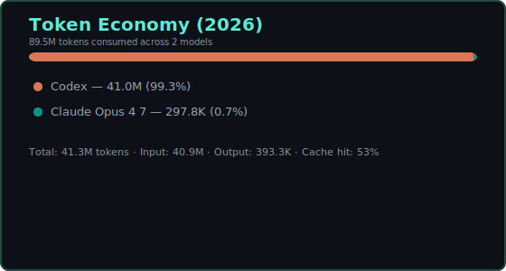
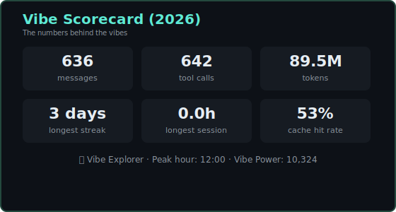
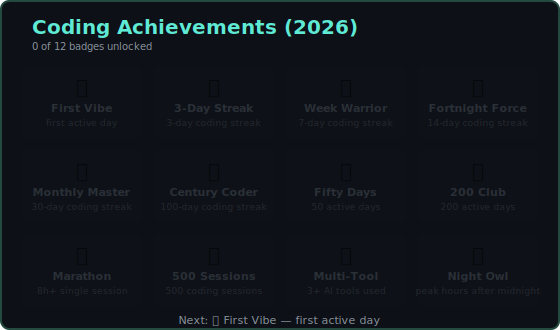

# 😸Into
👉 Human & Humanoid-centered learning(motion generation, physics-based character control, interaction, etc.) 

👉 I like **Basketball, Fitness & Travel** despite DDL approaching. 

👉 I'm interested in embodied && MLLM-related topics and open to any cooperative opportunity!!  
    
# ⚒️Stack

<!-- vibe-heatmap:start -->

### 🌟 **VibeTrace** — AI coding heartbeat

Yearly heatmap & tool usage (auto-published)

  
  

  
  

Auto-published · Last refreshed: 2026-04-30 09:00 UTC

<!-- vibe-heatmap:end -->
