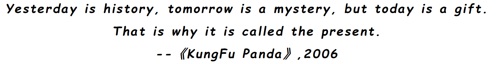

## Hi there!👋 This is Zhirui(Raymond).
- 🔭 I’m currently a senior student of NPU(西北工业大学).I will be at SKD(上海科技大学) for postgraduate study in Sep 2025.
- 🌱 I’m interested in Robot Learning & Generative AI in my upcoming research career.
- 🏀 I'm a huge fan of basketball and 👑LeBron James.I also fascinate doing fitness training at lesuire.
- 🙌🏻 ***Looking for any potential academic cooperation!***

## My Skill Set

Feel free to contact me if you're interested in any of my work!

<!--
**Zhirui86/zhirui86** is a ✨ _special_ ✨ repository because its `README.md` (this file) appears on your GitHub profile.

Here are some ideas to get you started:

- 🔭 I’m currently working on ...
- 🌱 I’m currently learning ...
- 👯 I’m looking to collaborate on ...
- 🤔 I’m looking for help with ...
- 💬 Ask me about ...
- 📫 How to reach me: ...
- 😄 Pronouns: ...
- ⚡ Fun fact: ...
-->
